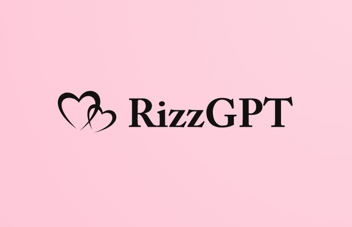

<!-- PROJECT SHIELDS -->
<!--
*** I'm using markdown "reference style" links for readability.
*** Reference links are enclosed in brackets [ ] instead of parentheses ( ).
*** See the bottom of this document for the declaration of the reference variables
*** for contributors-url, forks-url, etc. This is an optional, concise syntax you may use.
*** https://www.markdownguide.org/basic-syntax/#reference-style-links
-->
[![Contributors][contributors-shield]][contributors-url]
[![Forks][forks-shield]][forks-url]
[![Stargazers][stars-shield]][stars-url]
[![Issues][issues-shield]][issues-url]
[![MIT License][license-shield]][license-url]
[![LinkedIn][linkedin-shield]][linkedin-url]

<!-- PROJECT LOGO -->
 

  

<h3 align="center">RizzGPT</h3>

  

    your personal AI wingman!
     
    <a href="https://www.youtube.com/watch?v=SfHPnzGl8rc"><strong>Demo Video Link! »</strong></a>
     
     
    <a href="https://devpost.com/software/rizzgpt">Devpost Link</a>
    ·
    <a href="https://github.com/Dru-O7/RizzGPT/issues">Report Bug</a>
    ·
    <a href="https://github.com/Dru-O7/RizzGPT/issues">Request Feature</a>
  

## Inspiration
The idea for RizzGPT came from our shared love for humor, witty one-liners, and romantic gestures. We wanted to create a fun and useful tool that could help people break the ice and start conversations with their crushes or partners. We also wanted to showcase the capabilities of AI and natural language processing in a practical and engaging way.

## What it does
RizzGPT is an AI wingman that helps you craft better pickup lines and impress your crush or partner. It uses OpenAI's GPT-3 model to analyze your pickup line, provide feedback, and suggest better options. You can input your pickup line on the website, and the AI will rate it on a scale of 1-10, give you feedback on what worked and what didn't, and suggest alternative lines that may be more effective.

In addition to the rating system, RizzGPT also has a leaderboard hall of fame for the best pickup lines that users have submitted. You can browse through the leaderboard to get inspiration for your next conversation starter or submit your own successful pickup line to join the hall of fame.

Finally, RizzGPT also allows you to send the better options generated by the AI to your crush's phone number using Twilio's messaging API. This feature makes it easy to turn your newfound wit into action and make a memorable impression on your crush.

## How we built it
We built RizzGPT using a combination of modern web development tools and APIs. The frontend was built using HTML, CSS, and vanilla JavaScript. We used Bootstrap to style the website and make it responsive to different screen sizes.

For the backend, we used Node.js and Express to build the server-side API that handles user requests and communicates with the OpenAI and Twilio APIs. We integrated OpenAI's GPT-3 model using their official API to generate better options for pickup lines. We also used Twilio's messaging API to send the better options to users' phones.

## Challenges we ran into
One of the main challenges we faced was integrating with the OpenAI API. Since the GPT-3 model is a complex neural network with billions of parameters, it requires significant computational resources to run. We had to optimize our API calls to minimize the amount of data sent to and from the OpenAI servers while still providing accurate and useful feedback to users.

Another challenge was handling user input and output securely. Since RizzGPT involves sending messages to users' phones, we had to ensure that user data was properly sanitized and that the Twilio API was used responsibly to prevent spam or abuse.

## Accomplishments that we're proud of
We are proud of the seamless integration of multiple APIs to create a fun and useful tool for users. We are also proud of the design and user experience of the website, which we aimed to make clean, modern, and easy to use.

We are also proud of the achievement of creating a working AI wingman that can analyze and generate better options for pickup lines, giving users the confidence to break the ice and start conversations with their crushes.

## What we learned
Through building RizzGPT, we learned about the capabilities and limitations of AI and natural language processing. We also learned about best practices for building secure web applications that handle user data responsibly. Additionally, we learned about how to integrate with multiple APIs to create a cohesive and powerful tool.

See the [open issues](https://github.com/Dru-O7/RizzGPT/issues) for a full list of proposed features (and known issues).

(<a href="#readme-top">back to top</a>)

<!-- CONTRIBUTING -->
## Contributing

Contributions are what make the open source community such an amazing place to learn, inspire, and create. Any contributions you make are **greatly appreciated**.

If you have a suggestion that would make this better, please fork the repo and create a pull request. You can also simply open an issue with the tag "enhancement".
Don't forget to give the project a star! Thanks again!

1. Fork the Project
2. Create your Feature Branch (`git checkout -b feature/AmazingFeature`)
3. Commit your Changes (`git commit -m 'Add some AmazingFeature'`)
4. Push to the Branch (`git push origin feature/AmazingFeature`)
5. Open a Pull Request

(<a href="#readme-top">back to top</a>)

<!-- LICENSE -->
## License

Distributed under the MIT License. See `LICENSE` for more information.

(<a href="#readme-top">back to top</a>)

## Our ♥️ Contributors

# FREE & OPEN SOURCE PROJECT - HECK YEAHH!

<!-- MARKDOWN LINKS & IMAGES -->
<!-- https://www.markdownguide.org/basic-syntax/#reference-style-links -->
[contributors-shield]: https://img.shields.io/github/contributors/arncv/Business-Ship.svg?style=for-the-badge
[contributors-url]: https://github.com/arncv/Business-Ship/graphs/contributors
[forks-shield]: https://img.shields.io/github/forks/arncv/Business-Ship.svg?style=for-the-badge
[forks-url]: https://github.com/arncv/Business-Ship/network/members
[stars-shield]: https://img.shields.io/github/stars/arncv/Business-Ship.svg?style=for-the-badge
[stars-url]:https://github.com/arncv/Business-Ship/stargazers
[issues-shield]: https://img.shields.io/github/issues/arncv/Business-Ship.svg?style=for-the-badge
[issues-url]: https://github.com/arncv/Business-Ship/issues
[license-shield]: https://img.shields.io/github/license/arncv/Business-Ship.svg?style=for-the-badge
[license-url]: https://github.com/arncv/Business-Ship/blob/master/LICENSE
[linkedin-shield]: https://img.shields.io/badge/-LinkedIn-black.svg?style=for-the-badge&logo=linkedin&colorB=555
[linkedin-url]: https://linkedin.com/in/arnvgl
[product-screenshot]: assets/img/brand/screenshot.png
